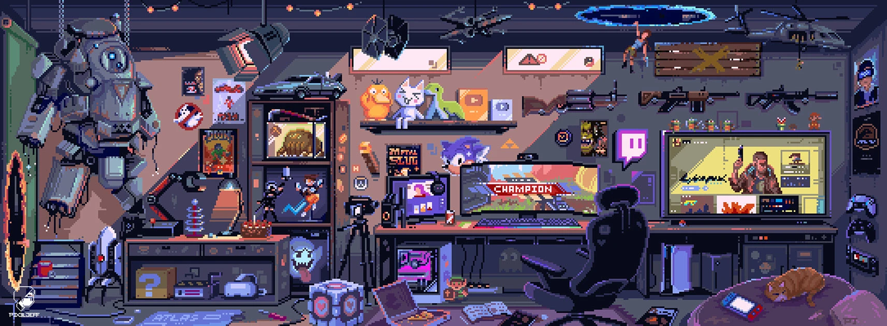
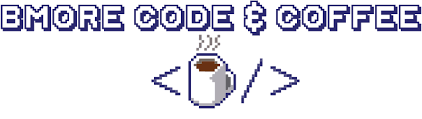

  

  

  <!-- Typing SVG by DenverCoder1 - https://github.com/DenverCoder1/readme-typing-svg -->
  

<h3>💻 Software and Tools</h3>

  

      
      
      
      
      
      
      
      
      
      
      
      
      
      
      
      
      
      
      
      
      
      
  

  <h3>🔥 Streak Stats</h3>

 
<!-- Snake Game Repo View -->

  

 
<h1><i>Turing coffee into code since 2023</i></h1>

  

